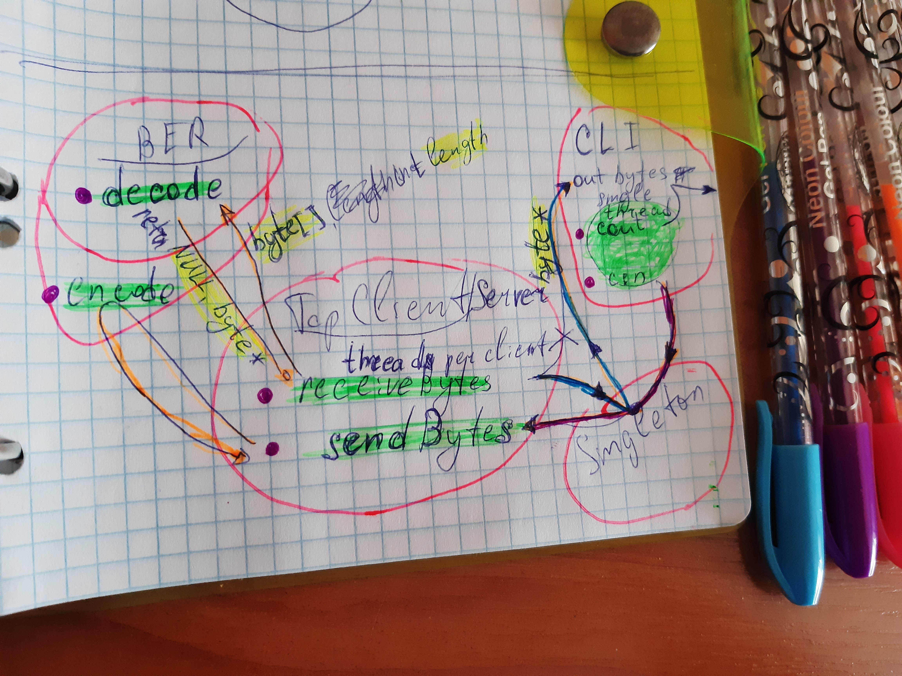

# TestCXX_BER
Encoding/decoding by standard [BER ANS.1](https://docs.oracle.com/cd/E19476-01/821-0510/def-basic-encoding-rules.html) without implementing a Tag (tag-length-value)

## Description


### My task is: write length encoding / decoding functions
**Length octets:** There are two forms: short (for lengths between 0 and 127), and long definite (for lengths between 0 and 2^1008 -1).
  - Short form. One octet. Bit 8 has value "0" and bits 7-1 give the length.
  - Long form. Two to 127 octets. Bit 8 of first octet has value "1" and bits 7-1 give the number of additional length octets. Second and following octets give the length, base 256, most significant digit first.


## Build by default using CMake (Linux, Windows, MacOS):
```
$ mkdir build
$ cd build
$ cmake ..
$ cmake --build .
```

## Usage:
- **Run**
  #### Linux/MacOS from `project_root/build/`
  - run server:
  ```
  $ ./server [arg]
  ```
  - run client:
  ```
  $ ./client [arg]
  ```
  #### Windows from `project_root/build/Debug/`
  - run server:
  ```
  $ ./server.exe [arg]
  ```
  - run client:
  ```
  $ ./client.exe [arg]
  ```

- **Exchange data:**
  - Type `something` and enter to send
  ```
  Hello from this side :)
  ```

## Picture for understanding of code architecture


#### Let's explain
1. Connection -> Input/Output
    - Application connects to the server/client and begins to `receiveBytes`
    - Received data `decodes` after that `prints` in console
2. Input/Output -> Connection
    - User enters the `input` then calls `sendBytes`
    - Which calls `encode` and finally sends data

### Library
I'v choosen [Poco](https://github.com/pocoproject/poco) library which is easy to build and use. It's provided with understandable [documentation](https://pocoproject.org/docs/00200-GettingStarted.html) in their site
> I have a little bit changed their CMakeList.txt to remove some packages (if it's really works) and build as subdirectory

#### TODO: Add some commands such us
- [ ] send_hex: 48 69 21;  // it's for 'Hi!'
- [ ] print_hex;
- [ ] send_file: ./message.txt;
- [ ] write_into_file: 1, ./box.png;  // first received to file box.png
- [ ] Multiple commands: send:hello; send:good bay;
